# 7.特拉菲克作为永恒的入口

在最后一章中，您将尝试 Traefik 与 Kubernetes 容器编排平台的本机集成。Kubernetes 无疑是最受欢迎的容器微服务平台。Traefik 与 Kubernetes 紧密结合，可以充当 Kubernetes 生态系统中的一等公民。您已经尝试了 Traefik 的许多网关功能。本章探讨了这些功能如何轻松地映射到 Kubernetes 入口概念。您还可以看到 Traefik 与 Jaeger 的简单集成，Jaeger 是一个特定于 Kubernetes 的分布式跟踪解决方案。

Note

与前几章一样，重点仍然是 Traefik 如何与 Kubernetes 生态系统集成，而不是它的高级特性。我们假设您对 Kubernetes 原语有基本的了解，因此我们只解释 Traefik 如何映射到它们。

## trafik 作为 kubernetes 入口控制器

Kubernetes 主要是一个 orchestrator/scheduler 和一个支持所需状态配置的 API 服务器。通常，客户端向 Kubernetes API 服务器提交声明性的 YAML 资源请求，Kubernetes 相应地提供所请求的资源。对于 Kubernetes API 服务器支持的每一种资源类型，比如部署或服务，默认的 Kubernetes 控制器会处理和提供提交的资源请求。一个例外是*入口*资源类型。

入口对象在单个资源中定义流量路由规则(例如，负载平衡、SSL 终止、基于路径的路由)，以在集群外部公开多个服务。根据 Kubernetes 官方文档:

> *Ingress 是允许入站连接到达后端定义的端点的规则集合。入口可以被配置为向服务提供外部可达的 URL、负载平衡流量、终止* SSL *，提供基于名称的虚拟主机等。*

这与 Traefik 充当 API 网关的方式没有太大区别。*入口控制器*是负责提供提交的入口请求的组件。Kubernetes 不附带默认入口控制器。第三方供应商提供实现。有一个参考(也是广泛使用的)基于 nginx 的 nginx-ingress-controller(它有三个不同的版本)，但是最终用户可以自由部署他们喜欢的任何其他 ingress 控制器。在本章中，我们将 Traefik 作为入口控制器的选择。

Traefik 在早期版本中支持 Ingress API。但是在 Traefik v2 中，他们对配置方法做了一些更改。这是由于入口 API 中的限制，这些限制困扰着规范。

Ingress API 规范花了很长时间进行测试。自 Kubernetes 版本 1.2 以来，它一直处于 v1beta1 状态。该规范仅在 2019 年正式定稿，并在 Kubernetes 版本中获得 GA 地位。基本规范相当简单，但是在各种各样的实现中制定一致的标准是一个挑战。没有好的方法来传递特定于供应商的配置，以针对特定的实现进行微调。实现者开始在 YAML 定义中的许多自定义注释中定义特定于供应商的配置，导致了空间的碎片化。Traefik 的旧版本遵循相同的方法。还有一些歧义，比如结尾的“/”处理得不一致(也有问题)。最终，规范是不精确的，既不是可移植的，也不是功能丰富的，所以拥有一个标准 API 的初衷从未实现。许多第三方供应商没有采用 ingress 规范，而是将 LoadBalancer 服务类型与他们自己的定制配置一起使用——同样是通过注释。一旦规范最终确定，大使 API Gateway 将在 2019 年建立入口支持。

大多数 Kubernetes 社区现在已经脱离了定制注释(对于其他用例也是如此)和入口规范，而转向*定制资源定义* (CRDs)。CRD 在集群中定义了一个新的对象种类，并让 Kubernetes API 服务器处理它的生命周期。Kubernetes 是一个对扩展开放的系统，允许外部实现者定义他们的自定义资源 API 定义，并运行自定义控制器来处理这些自定义 API 资源。

第三方的 ingress 实现被重组为他们定义的 CRD 的 Kubernetes 控制器。Contour 是首批引入 CRD 进行配置的入口 API 网关之一。甚至 Ambassador Gateway 现在也推荐使用自己的 CRDs，而不是新的 ingress 支持。Traefik 紧随其后，Traefik v2 引入了 IngressRoute(和其他)CRD，为在 Kubernetes 中配置 Traefik 路由提供了一种更好的方式。

Traefik 现在有两个独立的 Kubernetes 提供商。一个是传统的 Kubernetes ingress 提供程序，其中 Traefik 的行为与任何其他 Kubernetes ingress 控制器完全一样，并使用许多自定义注释。另一个是 Kubernetes CRD 提供商，这是我们本章的重点。Traefik 的所有入口配置都使用 Traefik 的 IngressRoute 和其他 CRD 提交给 Kubernetes。这为在 Kubernetes 上配置 Traefik 提供了更好的体验，是目前推荐的方法。

Note

在这一章中，*服务*这个词是重载的。*服务*的常见含义是公开 API 的应用程序，这是我们通常使用的术语。在 Traefik 配置的上下文中还有一个*服务*，它指向一个实际的后端服务。在这一章中，还有一个 Kubernetes 服务，这就是 Kubernetes 如何将流量路由到 pods。为了避免混淆，我们明确地说明了所有事件的含义。

## 在 kubernetes 安装 trafik

在本章中，我们将在一台笔记本电脑上运行一个本地 Kubernetes 集群来进行 Traefik 安装和配置。本地 Kubernetes 的安装不在本书讨论范围之内，但是从官网设置应该不会太复杂。我们在不同的场景下使用 microk8s ( [`https://microk8s.io/`](https://microk8s.io/) )(在 macOS 上运行多次)或 minikube ( [`https://minikube.sigs.k8s.io/docs/`](https://minikube.sigs.k8s.io/docs/) )。

Microk8s 使得一些高级 Kubernetes 应用程序的设置变得非常简单，而 minikube 是运行 Kubernetes 本地版本的事实上的标准。您可能更喜欢使用您喜欢的任何其他 Kubernetes 风格，例如启用了 Kubernetes 的 Docker Desktop。您也可以使用基于云的托管产品。此外，我们针对后面的几种情况转向托管云产品。

我们预计本地和云 Kubernetes 之间的 Traefik 配置和安装不需要任何更改。使用云产品的原因是为了再次使用公共 TLS 证书(类似于第 [4](4.html) 章)。对于使用 Let's Encrypt 的 TLS 终止，我们在 DigitalOcean (DOKS)上提供了一个云 Kubernetes 集群。如果你愿意的话，你可以选择使用其他品牌，如 GKE、AKS 或 EKS。我们概述的大多数步骤应该可以在任何 Kubernetes 发行版上按原样工作。

我们已经运行了本地的 Kubernetes 集群。所有对 Kubernetes API 服务器的请求都是通过 kubectl CLI 进行的，它通常与本地 Kubernetes 发行版一起安装。Kubectl 需要一个 kube 上下文配置来指向我们的目标 Kubernetes 集群。我们首先在集群上手动安装 Traefik。然后，我们将在后面的小节中探索一种更简单的安装机制。为了在 Kubernetes 上启动和运行 Traefik，我们需要三部分配置。

*   Kubernetes RBAC 配置给 Traefik 足够的权限与 API 服务器对话。

*   我遇到了 CRD

*   实际的交通部署

Note

这些是标准的 Traefik 部署文件。我们鼓励您在 [`https://docs.traefik.io/providers/kubernetes-crd`](https://docs.traefik.io/providers/kubernetes-crd) 和 [`https://docs.traefik.io/routing/providers/kubernetes-crd`](https://docs.traefik.io/routing/providers/kubernetes-crd) 从 Traefik 文档中获取所有这些的更新版本。

```py
# First install the RBAC security configuration
% kubectl apply -f traefik-rbac.yml
clusterrole.rbac.authorization.k8s.io/traefik-ingress-controller created
clusterrolebinding.rbac.authorization.k8s.io/traefik-ingress-controller created

# RBAC configuration details, full configuration omitted for brevity
rules:
  - apiGroups:
      - ""
    resources:
      - services
      - endpoints
      - secrets
    verbs:
      - get
      - list
      - watch
  - apiGroups:
      - extensions
    resources:
      - ingresses
    verbs:
      - get
      - list
      - watch
  - apiGroups:
      - extensions
    resources:
      - ingresses/status
    verbs:
      - update
  - apiGroups:
      - traefik.containo.us
    resources:
      - middlewares
      - ingressroutes
      - traefikservices
      - ingressroutetcps
      - ingressrouteudps
      - tlsoptions
      - tlsstores
    verbs:
      - get
      - list
      - watch

Listing 7-1Installing Traefik RBAC via kubectl

```

同样，Kubernetes 提供了一个声明性的 API 服务器，所以清单 [7-1](#PC1) 中的 RBAC 配置向 Kubernetes 服务授予 Traefik 读取权限，并在它的自定义资源上使用`traefik.containo.us` API 组(尽管我们还没有安装 CRDs)。Traefik 可以观察这些类型的对象的变化，并相应地重新配置自己。接下来，我们安装清单 [7-2](#PC2) 中的 Traefik CRDs。

```py
% kubectl apply -f traefik-crd.yml
customresourcedefinition.apiextensions.k8s.io/ingressroutes.traefik.containo.us created
customresourcedefinition.apiextensions.k8s.io/middlewares.traefik.containo.us created
customresourcedefinition.apiextensions.k8s.io/ingressroutetcps.traefik.containo.us created
customresourcedefinition.apiextensions.k8s.io/ingressrouteudps.traefik.containo.us created
customresourcedefinition.apiextensions.k8s.io/tlsoptions.traefik.containo.us created
customresourcedefinition.apiextensions.k8s.io/tlsstores.traefik.containo.us created
customresourcedefinition.apiextensions.k8s.io/traefikservices.traefik.containo.us created

# IngressRoute CRD

apiVersion: apiextensions.k8s.io/v1beta1
kind: CustomResourceDefinition
metadata:
  name: ingressroutes.traefik.containo.us

spec:
  group: traefik.containo.us
  version: v1alpha1
  names:
    kind: IngressRoute
    plural: ingressroutes
    singular: ingressroute
  scope: Namespaced

# Rest omitted for brevity

Listing 7-2Installing Traefik CRDs via kubectl

```

我们安装了清单 [7-2](#PC2) 中列出的 7 个 CRD。这些都是为不同类型的自定义配置提供的 CRDs Traefik。这个数字将来可能会增加。我们没有挑挑拣拣，而是把它们全都安装了。我们列出了 Ingres route CRD，它在接下来的部分中被大量使用。具体细节不是很有意思。需要安装 CRDs，以便 Traefik 可以监视对 API 服务器的任何这类定制资源请求，并对其进行操作。Traefik 充当 Kubernetes 控制器，对这些自定义资源类型进行操作。根据清单，每种不同类型的 Traefik 特定配置都有不同的 CRD。这是新 CRD 方法带给我们的一大优势。早些时候，很多这样的内容会被定义为标准入口资源上的自定义注释。

接下来，我们安装 Traefik(参见清单 [7-3](#PC3) )。我们将 Traefik 安装为带有一个 pod 的 Kubernetes 部署。Kubernetes 始终保持至少一个 Traefik 实例运行。由于 Traefik 是一个无状态服务，所有配置都来自 Kubernetes，因此即使 pod 重新启动，Traefik 也会保留配置。

```py
% kubectl apply -f traefik.yml
serviceaccount/traefik-ingress-controller created
deployment.apps/traefik created
service/traefik created

Listing 7-3Traefik Installation via kubectl

```

至此，Traefik 已经安装并运行在我们的集群上。在 Kubernetes 的上下文中，安装应用程序和运行应用程序没有区别。它会在容器中自动启动。让我们看看清单 [7-4](#PC4) 中的一些部署配置。

```py
# Many fields omitted for brevity
kind: Deployment
metadata:
  name: traefik
spec:
  replicas: 1
  template:
    spec:
      containers:
        - name: traefik
          image: traefik:v2.2 #the Traefik Docker image used
          args:
            - --log.level=DEBUG
            - --api.insecure
            - --api.dashboard
            - --entrypoints.web.address=:80
            - --entrypoints.traefik.address=:8080
            - --providers.kubernetescrd
          ports:
            - name: web
              containerPort: 80
            - name: traefik
              containerPort: 8080
kind: Service
metadata:
  name: traefik

spec:
  type: NodePort
  ports:
    - protocol: TCP
      port: 80
      name: web
      targetPort: 80
    - protocol: TCP
      port: 8080
      name: traefik
      targetPort: 8080

Listing 7-4Traefik Deployment Configuration

```

我们在清单 [7-4](#PC4) 中列出了 Traefik 部署和服务的部分配置。您可以看到要部署的映像版本和副本的数量。Traefik 作为一个无状态服务运行，其状态由 Kubernetes 管理，因此根据需要运行多个副本进行扩展是没有问题的(因为它不必形成有状态的集群)。

有趣的部分是静态配置。动态 Traefik 配置全部由 Kubernetes 提供者在运行时提供，包括 Traefik 路由和 Traefik 服务。然而，静态配置——比如入口点和提供者——仍然需要在启动时提供。为此，Traefik 利用了常用的 CLI 参数方法。这是为 Docker 和 Kubernetes 传递 Traefik 静态配置的常用方式。我们从两个入口点开始:一个用于 HTTP 流量，另一个用于仪表板。我们还在不安全模式下公开仪表板，因为我们在本地运行，并将日志设置为所需的级别。这都是典型的东西。

新标志是`--providers.kubernetescrd`值。这确保了 Traefik 可以根据 Kubernetes CRDs 配置自己。微妙的是，它只选择新的基于 Traefik 的 CRD。如果您还希望 Traefik 充当标准的 Kubernetes 入口控制器，您必须传递`--providers.kubernetesingress`标志。您可以启用一个或两个提供程序。您还公开了 Traefik 端口本身，因此 Kubernetes 可以注册它们。不要忘记 Traefik 是作为 NodePort 类型的 Kubernetes 服务在集群外部公开的。服务如清单 [7-5](#PC5) 所示。

```py
% kubectl get svc traefik
NAME    TYPE       CLUSTER-IP     PORT(S)
traefik NodePort   10.110.30.69   80:31624/TCP,8080:32529/TCP

Listing 7-5Traefik Kubernetes Service

```

不管 Traefik 运行在哪个 Kubernetes worker 节点上(本地只有一个), Kubernetes 都会将任何 worker 节点上公开的节点端口上的任何传入流量转发给正在运行的 Traefik 实例。如果有多个 Traefik pods，Kubernetes 会自动在它们之间对请求进行负载平衡。这是节点端口服务类型的常见 Kubernetes 行为。在云场景中，我们将使用 Traefik 服务的负载平衡器类型，它启动云负载平衡器来公开 Traefik 服务，所有对 Traefik 的请求都通过负载平衡器 IP。云平台运行负载均衡器。在本地，我们通常使用节点端口，尽管一些本地 Kubernetes 发行版现在也通过特殊机制支持负载平衡器。

现在让我们看看 Kubernetes 公开的端口 31624 上的默认 Traefik 后端(见图 [7-1](#Fig1) )。此端口由 Kubernetes 随机分配，可能会有所不同。这会将请求转发到 HTTP 端口 80 上的 Traefik web 入口点。由于没有为这个入口点配置默认路由，我们照常得到 404。请注意，IP 地址是 minikube 虚拟机的本地 IP，可以使用`minikube ip`命令`.`访问


图 7-1

节点端口入口点上的默认后端

我们还暴露了另一个端口上的 Traefik 仪表板，以检查配置(参见图 [7-2](#Fig2) )。配置了两个入口点:`traefik`和`web`。`traefik`入口点服务于仪表板路由，而`web`用于所有其他 HTTP 流量。请注意，Traefik 文档建议不要在实际生产使用中以不安全的模式公开仪表板。第 [4](4.html) 章讲述了如何通过 TLS 安全地暴露仪表板。对于本地使用，现在可以这样访问它。

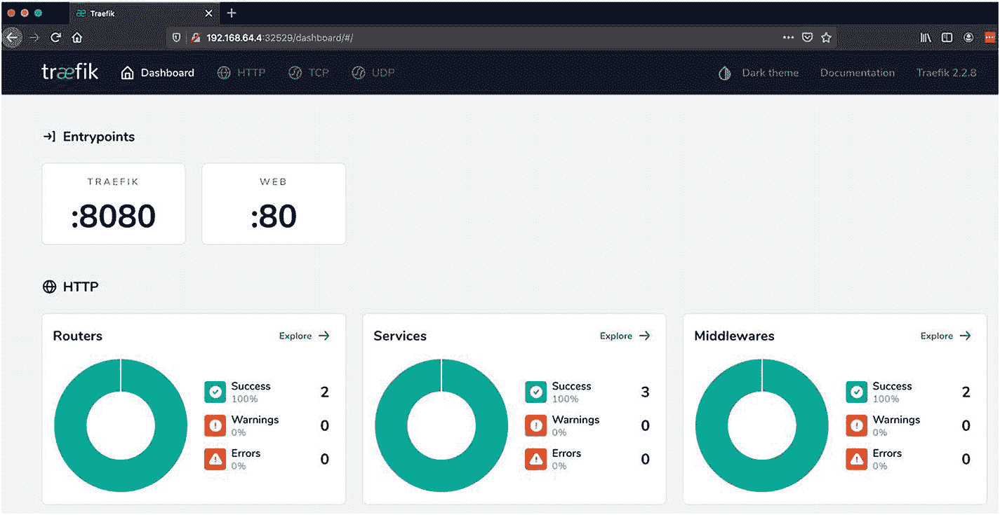

图 7-2

使用仪表板入口点的流量部署

如果您向下滚动到 Providers 部分，您会看到 Kubernetes CRD 提供商已启用(参见图 [7-3](#Fig3) )。在前面的章节中，我们使用了 FileProvider 和 Consul provider。旧的 Kubernetes 入口提供程序未启用，因此 Traefik 不作用于标准入口资源。

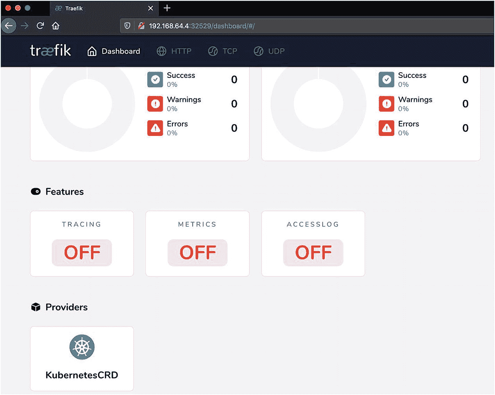

图 7-3

使用 kubernetes crd 提供程序进行 trafik 部署

接下来，我们在集群上部署一个 Kubernetes 服务，并尝试通过`traefik`入口点访问它。

### 安装 bookinfo 应用程序

现在 Traefik 已经启动并运行，让我们将一个微服务风格的应用程序部署到我们的集群中，它可以通过 Traefik 公开。为此，我们使用 Istio 文档中的 BookInfo 示例应用程序( [`https://istio.io/latest/docs/examples/bookinfo/`](https://istio.io/latest/docs/examples/bookinfo/) )。这个应用程序由几个不同的容器化微服务组成，虽然它主要是 Istio 服务网格的一个展示窗口，但我们可以将其用于 Traefik。

请注意，我们也可以使用上一章中的 Spring PetClinic 应用程序。然而，在撰写本文时，这个应用程序还不完全是 Kubernetes 的原生程序。我们必须做一些调整才能在 Kubernetes 上运行它。BookInfo 构建为运行在 Kubernetes 之上，因此我们可以直接关注部署后的部分。我们对它的实际代码不感兴趣。部署后，通过 Traefik 公开的唯一服务是主 web 应用程序，名为`productpage`。

web 应用程序在内部调用其余的服务。BookInfo 有许多不同的部署配置。我们只对基本部署感兴趣。这个文件在 [`https://github.com/istio/istio/blob/master/samples/bookinfo/platform/kube/bookinfo.yaml`](https://github.com/istio/istio/blob/master/samples/bookinfo/platform/kube/bookinfo.yaml) 。你可以下载它或者直接用原始网址应用它(参见清单 [7-6](#PC6) )。

```py
% kubectl apply -f bookinfo.yml
service/details created
serviceaccount/bookinfo-details created
deployment.apps/details-v1 created
service/ratings created
serviceaccount/bookinfo-ratings created
deployment.apps/ratings-v1 created
service/reviews created
serviceaccount/bookinfo-reviews created
deployment.apps/reviews-v1 created
deployment.apps/reviews-v2 created
deployment.apps/reviews-v3 created
service/productpage created
serviceaccount/bookinfo-productpage created
deployment.apps/productpage-v1 created

Listing 7-6Install bookinfo Services

```

部署和服务启动后，我们可以继续应用 IngressRoute。这很标准。它只是公开了 web 应用程序需要从浏览器调用的所有路径。我们必须创建自己的来与 Traefik 合作。然后，我们可以在 HTTP web 节点端口上访问 BookInfo 应用程序。首先，让我们看看 BookInfo 的 Kubernetes 服务中有哪些是可用的(参见清单 [7-7](#PC7) )。

```py
% kubectl get svc
NAME          TYPE        CLUSTER-IP        PORT(S)
details       ClusterIP   10.111.105.145    9080/TCP
productpage   ClusterIP   10.101.6.99       9080/TCP
ratings       ClusterIP   10.102.103.167    9080/TCP
reviews       ClusterIP   10.103.10.20      9080/TCP

% kubectl get deploy
NAME             READY   UP-TO-DATE   AVAILABLE
# 3 separate reviews deployments, rest omitted for brevity
reviews-v1       1/1     1            1
reviews-v2       1/1     1            1
reviews-v3       1/1     1            1

Listing 7-7BookInfo Services

```

清单 [7-7](#PC7) 是一组创建的 ClusterIP 类型的服务。这意味着它们可以相互通信，但在群集之外无法访问。我们必须使用 IngressRoute 公开的唯一服务是`productpage`服务。这是 BookInfo 的主要 web 应用程序，服务于端口 9080 上的请求。

我们可以为此服务应用一个 IngressRoute 自定义资源，以通过 Traefik 公开它。让我们首先来看看清单 [7-8](#PC8) 中这个资源的一些配置。您可以看到它大体上匹配我们通常通过 FileProvider 定义的动态配置。定义了一个入口点，并使用通常的匹配规则进行路由。有趣的部分是后端服务配置通常所在的部分。在这里，您可以看到我们直接引用了一个 Kubernetes 服务并通过 Traefik 路由找到了它。因此，IngressRoute 或多或少定义了从入口点到后端 Kubernetes 服务的 Traefik 路由。如果需要，我们也可以在这里参考 Traefik 中间件。

```py
spec:
  entryPoints:
    - web
  routes:
  - match: PathPrefix(`/productpage`) || PathPrefix(`/static`) || Path(`/login`) || Path(`/logout`) || PathPrefix(`/api/v1/products`)
    kind: Rule
    services:
    - name: productpage
      port: 9080

% kubectl apply -f bookinfo-product-ingress.yml
ingressroute.traefik.containo.us/bookinfo-productpage-ingress created

% kubectl get IngressRoute
NAME                           AGE
bookinfo-productpage-ingress   29s

Listing 7-8BookInfo IngressRoute

```

一旦服务在入口公开，我们就可以很容易地查看网页(见图 [7-4](#Fig4) )。这在内部调用其他 BookInfo 服务来填充页面每个部分的数据。由于点评服务由三个不同的点评部署支持(如清单 [7-7](#PC7) 所示)，该网页在每个请求上看起来可能略有不同。

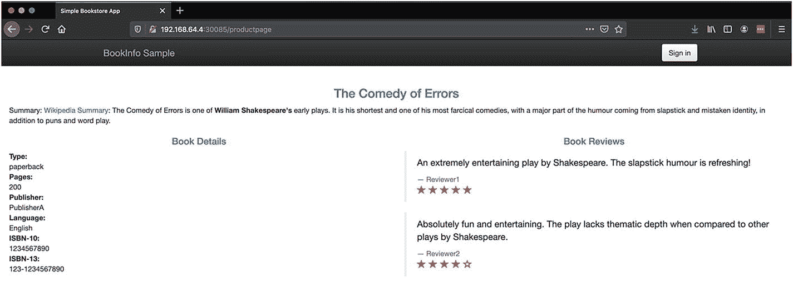

图 7-4

BookInfo 产品页面 UI

我们现在可以在 Traefik 仪表板中检查配置。您会看到路由器和服务配置显示出来。IngressRoute 已经自动创建了一个路由器和一个服务(Traefik 抽象，而不是 Kubernetes 抽象，尽管在本例中它们是相同的)。Kubernetes 服务由 Traefik 自动发现，并被视为 Traefik 中的服务抽象。您可以在如图 [7-5](#Fig5) 和 [7-6](#Fig6) 所示的仪表盘中看到路由器和服务信息。

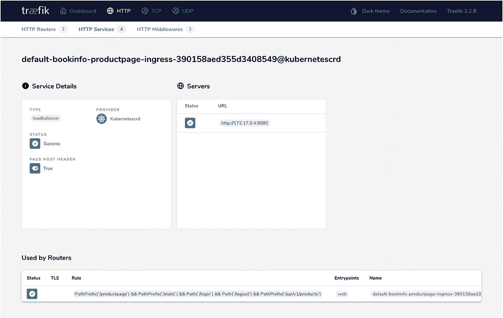

图 7-6

产品页面入口服务

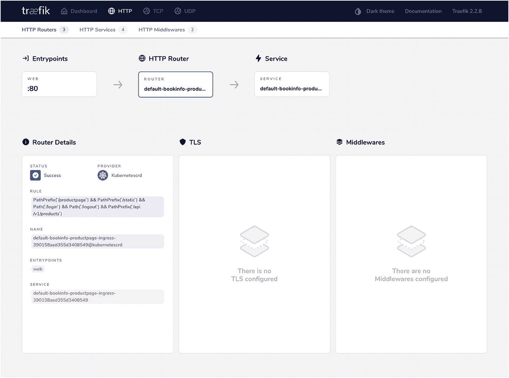

图 7-5

产品页面路由器

如果您浏览服务配置中的服务器(我们通常在这里定义后端服务的负载平衡器 IP)，您会看到相应 Kubernetes 服务的 pod IPs(参见图 [7-6](#Fig6) )。Traefik 可以自动检查来自 Kubernetes 的这些细节，并处理内部的 Kubernetes 网络(它需要这样做)。当 pod 发生任何变化时(例如，放大或缩小、pod 重新启动等。)时，Traefik 会自动选择它。这与上一章形成了有趣的对比。在那里，我们必须使用 Consul 提供者来跟踪服务，从而将 Traefik 与 Consul 服务注册中心集成起来。然而，Kubernetes 提供开箱即用的服务发现，Traefik 可以直接与 Kubernetes 对话以获取服务细节。

Note

此上下文中的 LoadBalancer 是指用于指定多个后端服务 IP 的 Traefik 配置，而不是 Kubernetes LoadBalancer。

如果还不清楚的话，这个例子说明了 IngressRoute 是如何以 CRD 风格实现 Traefik HTTP 路由器的。这是使用 CRD 方法优于普通入口的优势，它允许您更接近 Traefik 风格的配置。

## 安装带舵的 trafik

在上一节中，我们成功地在 Kubernetes 上部署了 Traefik，并使用它来公开服务。基本配置涉及一些不同的手动步骤。使用更高级的 Traefik 配置，所需的手动步骤可能会很快变得难以操作，特别是当我们希望随着时间的推移调整静态配置或定期升级 Traefik 时。对于生产安装，我们使用一个名为 Helm ( [`https://helm.sh/`](https://helm.sh/) )的包和发布管理器在 Kubernetes 上安装 Traefik。在 Helm 中，一个可部署的工件被捆绑到一个图表中，该图表封装了随着时间的推移安装和升级该软件所需的所有资源，包括配置和依赖关系。有一个 Traefik 舵图，我们从现在开始使用它来安装/升级 Traefik。Helm 重用由 kubectl 设置的当前 kubeconfig。我们已经安装了 Helm v3 的最新版本，并且我们的 kubeconfig 设置指向我们的本地 Kubernetes 集群。

中央 Helm 资源库(类似于 Maven central、PyPi 或 Debian apt 资源库)中可用的 Traefik 版本是较旧的 Traefik v1.7 版本。因此，在通过 Helm 安装 Traefik v2 之前，我们需要运行几个高级步骤(参见清单 [7-9](#PC9) )。这些注册了 Traefik v2 Helm 存储库，因此我们可以使用 Helm 安装 Traefik v2。确保您不会意外安装旧版本；它不支持 IngressRoute CRDs，并且工作方式有些不同。

```py
% helm repo add traefik https://containous.github.io/traefik-helm-chart
"traefik" has been added to your repositories

% helm repo update
Hang tight while we grab the latest from your chart repositories...
...Successfully got an update from the "traefik" chart repository
Update Complete. ☼ Happy Helming!☼

Listing 7-9Adding Traefik’s Helm repository

```

一旦完成，我们就可以使用 Traefik v2 的官方导航图安装它了。因为我们已经手动安装了 Traefik，所以我们需要重置整个集群(在 minikube 上很容易完成),或者删除到目前为止安装的所有东西。现在让我们进行全新安装。

### 探索 trafik 掌舵图

Traefik Helm chart 安装了将 Traefik 作为入口控制器运行所需的所有先决条件，包括 Kubernetes RBAC 配置和用于配置路由规则的 CRDs。除了一个例外，安装在本地或云 Kubernetes 上的方式是一样的。在托管云服务中，Traefik ingress 通过使用类型为 LoadBalancer *的 Kubernetes 服务向外界公开。*这会在所有 Kubernetes 节点前自动启动托管云负载平衡器，并将所有传入流量路由至 Traefik 入口控制器。对于外部世界，单一入口点是云负载平衡器的 IP 或 DNS 名称。

裸机或本地虚拟机上不提供负载平衡器。Minikube 和 microk8s 可以通过一种特殊的机制来处理这个问题，尽管使用节点端口通常更简单。您需要确保您选择的 Kubernetes 发行版支持 LoadBalancer 类型的服务。否则，您必须将 Traefik 入口公开为 NodePort 类型的 Kubernetes 服务。这必须在舵安装期间通过定制舵图表值来解决。这可以通过在命令行中将它们传递给 Helm 来实现，或者更好的方法是为自定义值定义一个文件，该文件可以在安装过程中覆盖默认值。

让我们来看看舵图上的一些默认值( [`https://github.com/containous/traefik-helm-chart/blob/master/traefik/values.yaml`](https://github.com/containous/traefik-helm-chart/blob/master/traefik/values.yaml) )以及一些我们想要定制的值(参见清单 [7-10](#PC10) )。

```py
# Configure the deployment with number of pods
deployment:
  replicas: 1

# IngressRoute for the dashboard will be installed
ingressRoute:
  dashboard:
    enabled: true

# Configure both types of dynamic Traefik providers
providers:
  kubernetesCRD:
    enabled: true
  kubernetesIngress:
    enabled: true

# Configure ports
ports:
  traefik:
    port: 9000
            # As recommended, the dashboard is not exposed by default in production
    expose: false
# The HTTP and HTTPS ports are opened by default
  web:
    port: 8000
    expose: true
  websecure:
    port: 8443
    expose: true

service:
  enabled: true
  type: LoadBalancer

rbac:
  # False value indicates Traefik can be used cluster-wide across all namespaces.
  namespaced: false

Listing 7-10Some of the Default Values in Traefik Helm Chart values.yaml

```

这不是任何一种标准的库本内特人清单。这些只是应用于 Helm 图表中 Kubernetes YAMLs 的 YAML 格式的配置值。默认情况下，它具有以下配置。

*   trafik 的一个实例在 kubernetes pod 中运行

*   Traefik 服务通过负载平衡器公开。这可能不适用于非云集群。

*   旧的和新的动态配置 Kubernetes 提供者都被启用。因此 Traefik 监视标准入口和 Traefik 的自定义入口路由资源。

*   打开了三个入口点:一个名为 9000 上的`traefik`，另外两个用于 HTTP 和 HTTPS 流量。稍后我们将进一步探讨这个额外的入口点。

*   将自动创建仪表板的 IngressRoute 自定义资源。但是，仪表板入口点不会向 Traefik Kubernetes 服务公开。这有点不一致和混乱，因为 Traefik 建议在生产中为仪表板创建您自己的安全入口。但是，我们可以在本地利用这个 IngressRoute。这种行为在我们能找到的任何地方都没有记录，所以将来可能会改变。

掌舵图的 default values.yaml 里有很多这样的条目。我们鼓励您自行探索进一步的配置。大部分都与在 Kubernetes 上可靠地运行 Traefik 有关。例如，未启用 Traefik pods 在负载下的自动缩放；如果需要，可以打开它。请注意，在写这本书的时候，这些观察是为了舵图的当前状态。图表继续发展。

在我们定制这些值之前，我们可以使用`helm template`命令来查看默认生成的部署清单。这些非常类似于我们在前面几节中用来手动安装 Traefik 的内容。让我们运行命令，看看最终的配置是什么样的。由于产量很多，我们只关注其中的几块。鼓励您自己运行该命令来查看完整的输出(参见清单 [7-11](#PC11) )。

```py
% helm template traefik traefik/traefik

# Partial values in the output
# Deployment configuration
       #Kubernetes liveness probe
        readinessProbe:
          httpGet:
            path: /ping
            port: 9000

       #Kubernetes liveness probe
        livenessProbe:
          httpGet:
            path: /ping
            port: 9000

       # Traefik CLI arguments
        args:
          - "--entryPoints.traefik.address=:9000/tcp"
          - "--entryPoints.web.address=:8000/tcp"
          - "--entryPoints.websecure.address=:8443/tcp"
          - "--api.dashboard=true"
          - "--ping=true"
          - "--providers.kubernetescrd"
          - "--providers.kubernetesingress"

# Service configuration
  type: LoadBalancer
  ports:
  - port: 80
    name: web
    targetPort: "web"
    protocol: "TCP"
  - port: 443
    name: websecure
    targetPort: "websecure"
    protocol: "TCP"

# IngressRoute
kind: IngressRoute
metadata:
  name: traefik-dashboard
spec:
  entryPoints:
    - traefik
  routes:
  - match: PathPrefix(`/dashboard`) || PathPrefix(`/api`)
    kind: Rule
    services:
    - name: api@internal
      kind: TraefikService

Listing 7-11Generated Helm Template with Default Values

```

让我们来分析一下清单 [7-11](#PC11) 中我们捕捉到了什么。静态配置通常通过 CLI 参数提供。我们已经提到了三个入口点和两个提供者。您还可以看到仪表板启用标志。您还会看到`ping` Traefik 服务已启用。我们稍后在仪表板中查看它；它暴露于`/ping`路径下的`traefik`端口。它为 Kubernetes 定期检查 Traefik pods 的健康状况提供了一种标准方法。如果健康探测失败，Kubernetes 会自动重启 Traefik pods。这提供了一种在 Kubernetes 上运行 Traefik 的弹性方法。

您会看到创建了一个 Ingres route`traefik-dashboard`来公开集群外部的仪表板。这在默认安装中不起作用。原因是 Traefik 的服务配置中不包括`traefik`入口点端口 9000。虽然可以在集群内部访问它以进行运行状况检查，但是不能通过节点端口访问它，并且无法到达该入口点来访问控制面板。

要在安装/升级时自定义一些默认值，我们可以在文件中覆盖它们，并将其提供给 Helm CLI。让我们看看清单 [7-12](#PC12) 中我们想要定制的值。虽然仪表板在生产中没有公开，但我们在这里覆盖了`traefik`入口点的配置，使仪表板在本地可用。我们将 Traefik 服务更改为 NodePort 类型，并将日志级别设置为`INFO`。如您所见，Traefik 静态配置仍然提供了 CLI 参数。舵轮图显示了一个`additionalArguments`特殊键来传递额外的参数。

```py
additionalArguments:
  - "--log.level=INFO"
ports:
  traefik:
    expose: true
service:
  type: NodePort

Listing 7-12custom-values.yml for Traefik Helm Chart

```

让我们再次运行 Helm template 命令，查看生成的带有自定义值的部署清单。我们仅在清单 [7-13](#PC13) 中列出新的/修改的值。这使用了我们在清单 [7-12](#PC12) 中详述的同一个`custom-values.yml`文件。

```py
% helm template --values=custom-values.yml traefik traefik/traefik

# Partial changed values in the output
# Deployment configuration
       # Traefik CLI arguments
        args:
          - "--log.level=INFO"

# Service configuration
  type: NodePort
  ports:
  - port: 9000
    name: traefik
    targetPort: "traefik"

Listing 7-13Generated Helm Template with Custom Values

```

现在，我们可以使用此配置访问集群外部的 Traefik 控制面板。让我们继续安装 Traefik。

### 本地安装

在安装 Traefik 之前，还有一个问题是我们希望将 Traefik 安装在哪个 Kubernetes 名称空间中。在生产中，如果 Traefik 负责集群范围的入口问题，那么 kube-system 名称空间是一个很好的选择。它与其他集群管理/操作服务一起存在。另一种方法是将 Traefik 限制在特定的名称空间，并为集群的其余部分使用不同的入口控制器(或不同的 Traefik 部署)。舵轮图支持开箱即用的`rbac.namespaced`配置。对于我们的例子，我们坚持使用默认的名称空间。

现在让我们用 Helm 命令安装 Traefik(参见清单 [7-14](#PC14) )。我们重用我们在清单 [7-12](#PC12) 中详述的同一个 custom-values.yml 文件。然后，我们运行几个命令来观察它是否被正确部署。由于仪表板端口 9000 现在暴露在节点端口上，您也可以打开仪表板(参见图 [7-7](#Fig7) )。

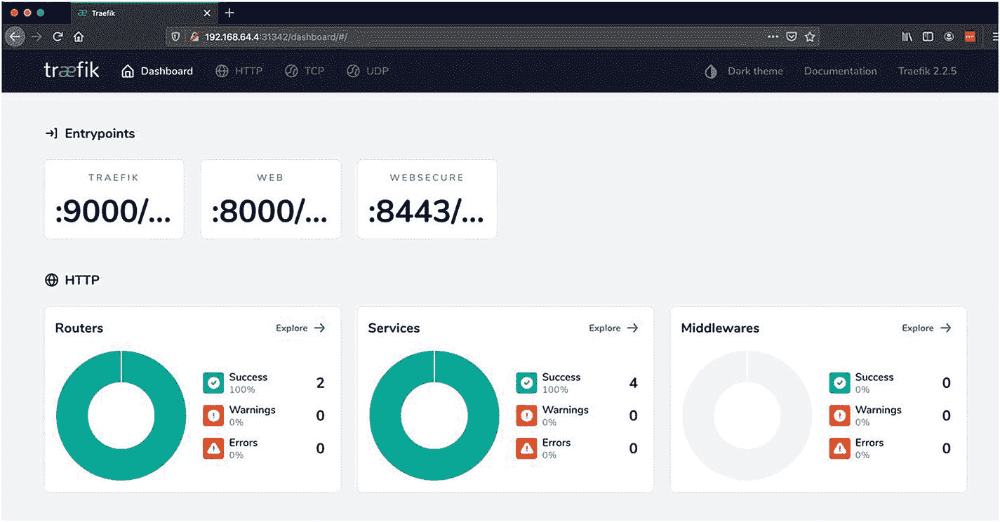

图 7-7

安装舵的入口点

```py
% helm install --values=custom-values.yml traefik traefik/traefik
NAME: traefik
LAST DEPLOYED: Wed Apr 22 00:26:27 2020
NAMESPACE: default
STATUS: deployed
REVISION: 1
TEST SUITE: None

% helm ls
NAME     NAMESPACE  REVISION  STATUS    CHART          APP VERSION
traefik  default      1       deployed  traefik-8.9.1  2.2.5

% kubectl get pods
NAME                     READY   STATUS    RESTARTS   AGE
traefik-5bcf58d556-vfhlv 1/1     Running       0      63s

% kubectl get svc traefik
NAME    TYPE    CLUSTER-IP    PORT(S)
traefik NodePort 10.99.103.150 9000:31342/TCP,80:30085/TCP,443:30615/TCP

% kubectl get svc traefik -o yaml
spec:
  clusterIP: 10.99.103.150
  externalTrafficPolicy: Cluster

  ports:
  - name: traefik
    nodePort: 31342
    port: 9000
    protocol: TCP
    targetPort: traefik
  - name: web
    nodePort: 30085
    port: 80
    protocol: TCP
    targetPort: web
  - name: websecure
    nodePort: 30615
    port: 443
    protocol: TCP
    targetPort: websecure
  selector:
    app.kubernetes.io/instance: traefik
    app.kubernetes.io/name: traefik
  sessionAffinity: None
  type: NodePort

% kubectl get IngressRoute traefik-dashboard -o yaml
apiVersion: traefik.containo.us/v1alpha1
kind: IngressRoute

spec:
  entryPoints:
  - traefik
  routes:
  - kind: Rule
    match: PathPrefix(`/dashboard`) || PathPrefix(`/api`)
    services:
    - kind: TraefikService
      name: api@internal

Listing 7-14Install Traefik Using Helm

```

在图 [7-7](#Fig7) 中，你可以在仪表板上看到我们的三个入口点。您还可以深入到路由器，查看到 Traefik 内部仪表板和 ping 服务的路由映射。您可能会对路由器的名称感兴趣。对于`ping@internal`服务，一切如常。然而，指向`api@internal`的仪表板 IngressRoute 有一个生成的名称(见图 [7-8](#Fig8) 和 [7-9](#Fig9) )。这是因为它有一个单独定义的 IngressRoute。所有定义的 IngressRoute 对象都使用类似的命名约定。

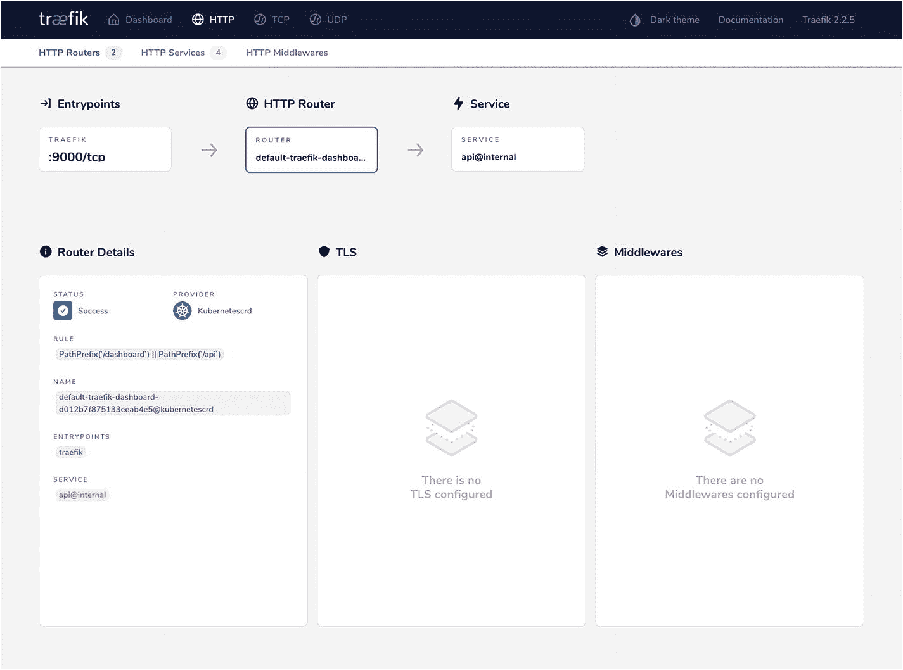

图 7-9

仪表板路线

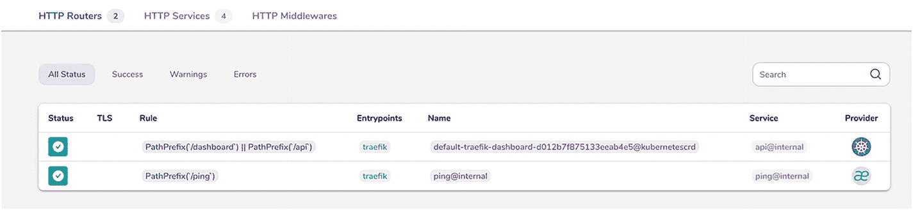

图 7-8

安装头盔的路线

Helm chart 还安装了所有必需的 Traefik CRDs。Traefik 依靠标准的 Kubernetes 声明性配置机制，通过这些 CRD 来配置自己。每种动态路由器配置都有不同的 CRD。让我们看看清单 [7-15](#PC15) 中安装了什么。

```py
% kubectl get crd
NAME
ingressroutes.traefik.containo.us
ingressroutetcps.traefik.containo.us
ingressrouteudps.traefik.containo.us
middlewares.traefik.containo.us
tlsoptions.traefik.containo.us
tlsstores.traefik.containo.us
traefikservices.traefik.containo.us

Listing 7-15Traefik CRDs

```

### 公开 bookinfo 评论服务

在前面的小节中，我们观察了 Traefik 如何直接与 Kubernetes 服务对话，以在不同的 pods 或服务实例之间实现负载平衡。虽然很容易，但这不允许您利用我们在第 [3](3.html) 章中观察到的一些特殊流量路由功能，例如加权循环或镜像。这是通过使用另一个名为 TraefikService 的 CRD 在 Kubernetes 上实现的。既然 Traefik 已经启动并运行了 Helm，那么让我们使用 BookInfo over Traefik 来尝试一个稍微复杂一点的用例。继续使用上一节中详述的相同步骤将 BookInfo 再次部署到集群中(参见清单 [7-6](#PC6) )。一旦我们这样做了，我们应该在集群中再次拥有 BookInfo 资源。

我们现在在 Traefik ingress 上公开的服务是 reviews 服务。`productpage`后端内部调用它。这是一个单一的 Kubernetes 服务，由三个独立的部署提供支持。评论服务将流量路由到三个 pod，它们的行为略有不同。

*   `reviews-v1`返回样品评论。

*   `reviews-v2`调用评级服务并返回黑色样本评级。

*   `reviews-v3`调用评级服务并返回红色样本评级。

我们在使用 Traefikservice 的同时使用 IngressRoute 来公开此服务。这允许您尝试使用 Kubernetes 提供者的加权循环策略。服务启动后，我们可以继续应用 IngressRoute。首先，我们为三个单独的部署创建三个额外的 Kubernetes 服务(参见清单 [7-16](#PC16) )。Traefikservice 必须指向现有的 Kubernetes 服务。

```py
apiVersion: v1
kind: Service
metadata:
  name: reviews-noratings
  labels:
    app: reviews
    version: v1
    service: reviews
spec:
  ports:
  - port: 9080
    name: http
  selector:
    app: reviews
    version: v1
---
apiVersion: v1
kind: Service
metadata:
  name: reviews-black
  labels:
    app: reviews
    version: v2
    service: reviews
spec:
  ports:
  - port: 9080
    name: http
  selector:
    app: reviews
    version: v2
---
apiVersion: v1
kind: Service
metadata:
  name: reviews-red
  labels:
    app: reviews
    version: v3
    service: reviews

spec:
  ports:
  - port: 9080
    name: http
  selector:
    app: reviews
    version: v3

% kubectl apply -f bookinfo-reviews-extsvcs.yml
service/reviews-noratings created
service/reviews-black created
service/reviews-red created

# We now have 4 reviews services, one from the original deployment
% kubectl get svc
NAME                TYPE        CLUSTER-IP      PORT(S)
reviews             ClusterIP   10.110.252.89   9080/TCP
reviews-black       ClusterIP   10.97.126.88    9080/TCP
reviews-noratings   ClusterIP   10.111.136.174  9080/TCP
reviews-red         ClusterIP   10.105.94.3     9080/TCP

Listing 7-16Three Separate Reviews Services

```

一旦这些服务就位，让我们定义一个 Traefikservice 来对其中两个应用加权循环策略(参见清单 [7-17](#PC17) )。我们以 3:1 的权重将`reviews-black`和`reviews-noratings`服务组合在一起。

```py
apiVersion: traefik.containo.us/v1alpha1
kind: TraefikService
metadata:
  name: reviews-v1v2
spec:
  weighted:
    services:
      - name: reviews-black
        port: 9080
        weight: 3
      - name: reviews-noratings
        port: 9080
        weight: 1

% kubectl apply -f bookinfo-reviews-traefikservice.yml
traefikservice.traefik.containo.us/reviews-v1v2 created

Listing 7-173 TraefikService Resources

```

我们现在应用一个 IngressRoute 来对外公开这些服务(参见清单 [7-18](#PC18) )。

```py
apiVersion: traefik.containo.us/v1alpha1
kind: IngressRoute
metadata:
  name: bookinfo-reviews-ingress
spec:
  entryPoints:
    - web
  routes:
  - match: PathPrefix(`/reviews`)
    kind: Rule
    services:
# We can define multiple services here for simple Round robin load balancing
    - name: reviews-v1v2
      kind: TraefikService
    - name: reviews-red
      port: 9080

% kubectl apply -f bookinfo-review-ingress.yml
ingressroute.traefik.containo.us/bookinfo-reviw-ingress created

% kubectl get IngressRoute
NAME                      AGE
bookinfo-review-ingress   29s

# Call reviews ingress on loop
% for ((i=1;i<=20;i++)); do curl http://192.168.64.5:30680/reviews/1 | jq ; done

Listing 7-18Reviews IngressRoute

```

如果您在一个循环中调用服务入口(参见清单 [7-18](#PC18) ，您会看到负载根据提供的权重分布在三个独立的实例中。我们得到的红色和黑色评论比没有评论的评论多。您可以在图 [7-10](#Fig10) 、 [7-11](#Fig11) 、 [7-12](#Fig12) 和 [7-13](#Fig13) 的仪表盘中查看这些服务和路由器。

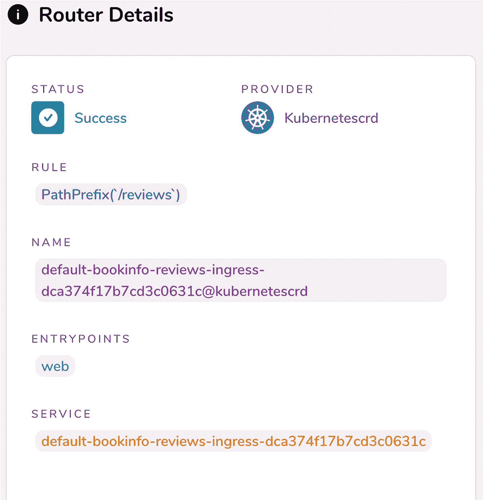

图 7-13

用于入口服务的路由器

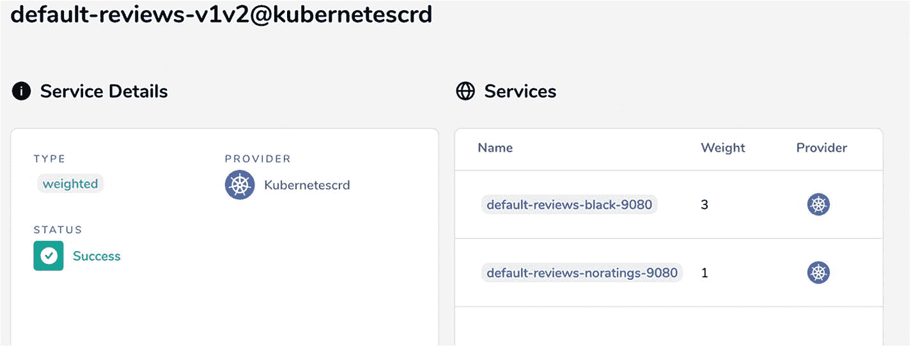

图 7-12

加权 Traefikservice

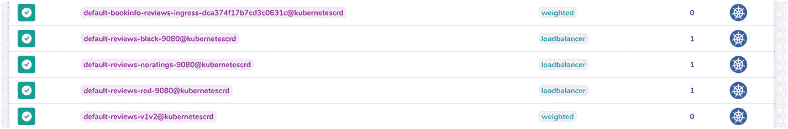

图 7-11

trafik 中的所有评论服务


图 7-10

生成的入口服务

## 用 Jaeger 配置请求跟踪

第 5 章展示了如何用 Zipkin 将 Traefik 集成到分布式跟踪设置中。虽然 Zipkin 几年来一直是 Spring Cloud 生态系统分布式追踪的默认选择，但在 Kubernetes 世界中，人们更喜欢使用 Jaeger ( [`www.jaegertracing.io`](http://www.jaegertracing.io) )。Jaeger 是由优步发布的 CNCF 分布式追踪系统，它为运行在 Kubernetes 上的服务分发追踪。Jaeger 适用于大规模部署，支持 OpenTracing 和其他标准。其背后的基本概念与 Zipkin 非常相似。它将跟踪头传播到下游服务，并根据发送到收集器的所有数据聚合跨度。Jaeger 是 Traefik 的默认跟踪后端。如果我们启用请求跟踪，并且不指定任何其他内容，Traefik 会自动采用 Jaeger 跟踪。

在 Traefik 中进行 Jaeger 配置之前，我们需要一个正在运行的 Jaeger 实例。耶格的完整设置是广泛的，超出了本书的范围。(数字海洋云上的最小设置需要至少四个 Kubernetes 工作节点。)出于演示目的，Jaeger 提供了一个 AllInOne 映像，它将所有组件打包在一个可执行文件中，并使用内存存储来部署在一个单独的 pod 中。这需要部署一个耶格操作员和相关的 CRD。类似于 Traefik 的 CRD，当我们向 Kubernetes 提交一个类型为`Jaeger`的资源时，它会启动 AllInOne Jaeger pod。如果你想更深入地了解 minikube 上的 Jaeger 设置，我们鼓励你采用这种方法。

在我们的例子中，我们采用了一种更简单的方法来设置 Jaeger，这避免了前面提到的所有复杂性。我们从 minikube 切换到另一个本地 Kubernetes 发行版 microk8s。我们使用现有的头盔图在上面安装 Traefik，然后在 microk8s 上启用 Jaeger(参见清单 [7-19](#PC19) )。这将自动部署 jaeger-operator 并启动一个简单的 jaeger 一体化部署，无需我们进行任何手动操作。然后，我们可以确定在启动配置中配置哪个服务端点。我们只对特定服务的几个端口感兴趣:一个 TCP 和一个 UDP(参见清单 [7-19](#PC19) )。

```py
% microk8s enable jaeger

% microk8s kubectl get pod
NAME                               READY   STATUS
jaeger-operator-7b58b969cf-vh8pp   1/1     Running
simplest-658764ffff-xktbp          1/1     Running

% microk8s kubectl get svc simplest-agent
NAME            TYPE      PORT(S)
simplest-agent  ClusterIP 5775/UDP,5778/TCP,6831/UDP,6832/UDP

Listing 7-19Enable Jaeger on microk8s

```

必须在启动时指定 Jaeger 特定配置以及请求跟踪配置。因为我们已经在集群上运行了 Traefik，所以我们可以调整配置并运行一个`helm upgrade`命令。这将启动一个启用跟踪的新 Traefik pod，并删除现有的一个。我们在 custom-values.yml 文件中添加了以下内容(参见清单 [7-20](#PC20) )。

```py
additionalArguments:
# New values in Helm configuration
  - "--tracing=true"
  - "--tracing.serviceName=traefik" # default value, can be omitted
  - "--tracing.jaeger=true" # default value, can be omitted
  - "--tracing.jaeger.samplingServerURL=http://simplest-agent:5778/sampling"
  - "--tracing.jaeger.localAgentHostPort=simplest-agent:6831"

% helm upgrade --values=custom-values.yml traefik traefik/traefik

Listing 7-20Additions in custom-values.yml and Helm Upgrade

```

您可以查看我们的仪表板，并在图 [7-14](#Fig14) 中看到 Jaeger tracing 已启用。

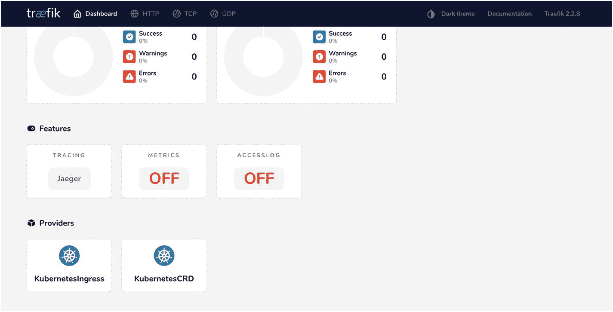

图 7-14

耶格追踪已启用

以下是默认设置的 Jaeger 配置参数。

*   tracing . jaeger . sampling type = const

*   tracing . jaeger . sampling param = 1.0

默认情况下，这会将所有轨迹发送给 Jaeger。这可以通过调整来控制采样轨迹的数量。

*   tracing.jaeger.propagation = jaeger 耶格

这个可以改成发送 Zipkin 式的痕迹，耶格可以解读。

文档中还有一些其他配置参数。我们需要设置的两个必需参数已经在清单 [7-20](#PC20) 中的 Helm 配置中。

由于跟踪是全局启用的，Traefik 现在开始向 Jaeger 收集器发送所有传入请求的跟踪。我们可以提出几个请求，然后检查 Jaeger UI(见图 [7-15](#Fig15) )。

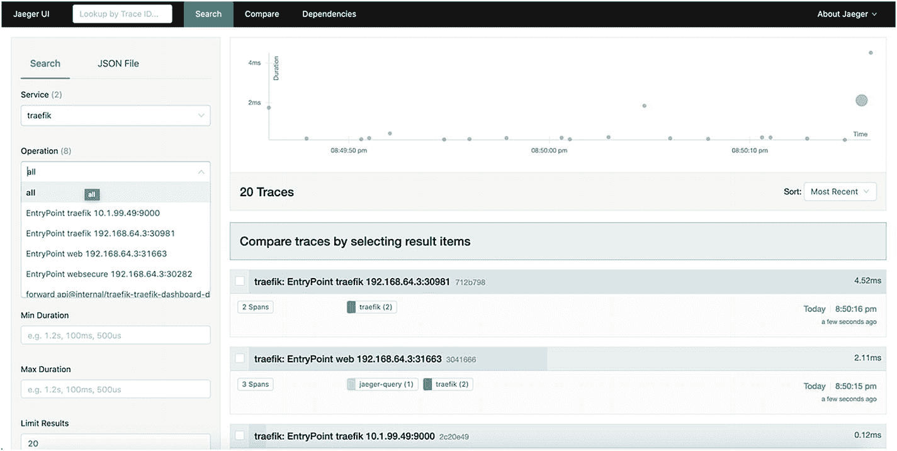

图 7-15

界面上的耶格痕迹

我们可以通过传入的`serviceName`配置来过滤跟踪，以隔离 Traefik 特定的跟踪，并进一步通过 Traefik 入口点来过滤。我们可以深入到特定的跟踪。图 [7-16](#Fig16) 中的是对 Traefik 仪表板的请求。

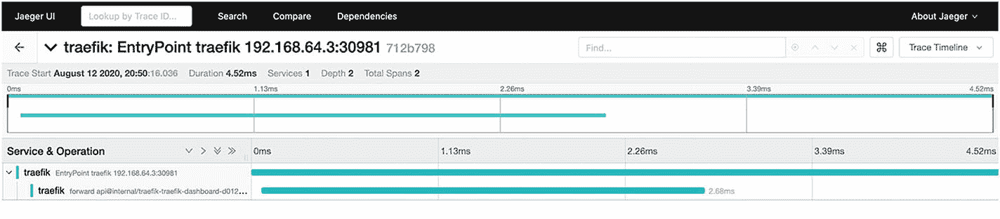

图 7-16

耶格追踪向下钻

这里还有一个有趣的地方。由于 Jaeger 实例运行在我们的集群中，我们如何访问 Jaeger UI 呢？它需要在节点端口上或通过 Traefik 入口(或另一个入口控制器)公开。由 microk8s 设置的 Jaeger 服务将其 UI 公开为集群中的默认入口规则。集群中有一个入口(不是 IngressRoute)资源，它是由 Jaeger 操作员自动创建的(参见清单 [7-21](#PC21) )。

```py
% microk8s kubectl get ingress simplest-query -o yaml
kind: Ingress
spec:
  backend:
    serviceName: simplest-query
    servicePort: 16686

Listing 7-21Jaeger UI Ingress on microk8s

```

您在本章的其他地方没有遇到过这种格式，因为您没有处理过纯 Kubernetes 入口资源。这为默认入口控制器定义了一个默认后端，所以如果我们点击根路径(/)上 Traefik 的 web/websecure 入口点，它会打开 Jaeger UI。您可以在 Traefik 仪表板中查看这一点，它已经为一个`default-backend`配置了一个`default-router`(参见图 [7-17](#Fig17) )。这种行为有两个原因。

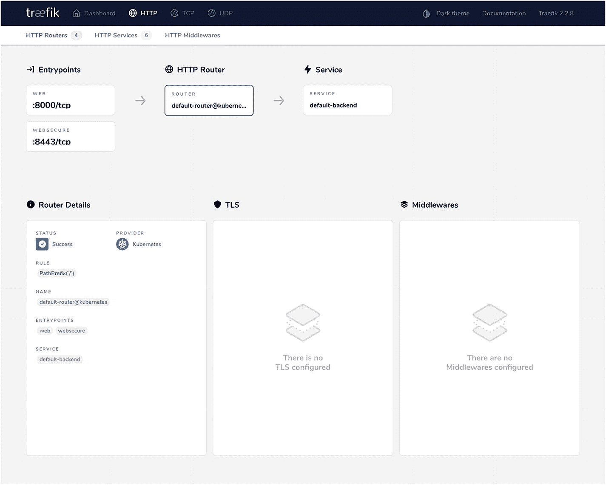

图 7-17

Jaeger 默认入口后端

*   Traefik Helm 图表设置了 Kubernetes CRD 供应商和普通 Kubernetes 供应商(如图 [7-14](#Fig14) 所示)。如果我们禁用了旧的提供程序，Traefik 不会注册它。

*   我们在此群集中没有其他入口控制器。默认的是 nginx-ingress-controller，但是我们没有启用它。Traefik 正在处理这次入侵。

虽然这不是我们想要的行为(这只是由于不可预见的变量，看起来不可定制，甚至没有记录)，但这只是为了我们的示例。它允许您说明 Traefik 对 Kubernetes ingress 的支持，我们跳过了这一步。在任何真实的用例中，都不是这样设置的。正确的做法是通过 IngressRoute 对象来公开 Jaeger UI。

## 数字海洋立方体云上的设置交通

现在让我们在 DigitalOcean Kubernetes (DOKS)上设置 Traefik。任何希望使用不同云提供商的人都可以这样做(AKS、EKA、GKE 等)。这是一个由 DigitalOcean 管理的云 Kubernetes 集群。集群的实际配置超出了本书的范围。

DigitalOcean 通过点击操作使其变得非常简单。一旦启动，您将获得下载 kubeconfig 的说明，这样您就可以使用本地 Kubernetes CLI (kubectl)连接到您的集群。对于云，在 DOKS 上将 Traefik 服务公开为默认类型的负载平衡器会自动为我们提供一个云负载平衡器。我们现在只在清单 [7-22](#PC22) 中定制 Helm 安装期间的日志级别。

从这里开始，kubeconfig 必须改为指向我们的云集群来执行所有命令。

```py
# kubeconfig has to be changed to point to cloud cluster for following commands
% helm install --set="additionalArguments={--log.level=INFO}" traefik traefik/traefik

% kubectl get svc traefik
NAME     TYPE         EXTERNAL-IP     PORT(S)
traefik  LoadBalancer  139.59.53.243    80:30415/TCP,443:32494/TCP

Listing 7-22Install Traefik Using Helm on Cloud LB

```

DigitalOcean 提供云负载平衡器。这个过程需要一点时间，之后我们获得公共外部 IP 来访问我们的入口点(参见清单 [7-22](#PC22) )。与 NodePort 不同，这里我们可以在默认端口上路由请求。回想一下，Traefik 会自动为 HTTPS 入口点生成一个自签名证书，因此您会看到如图 [7-18](#Fig18) 所示的端口 443。

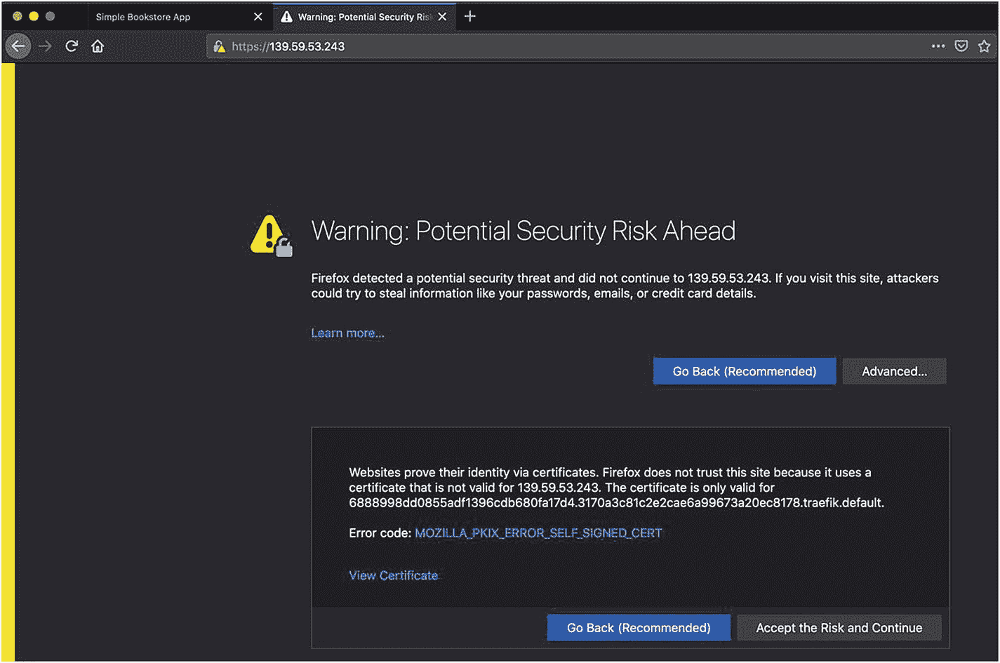

图 7-18

云负载平衡器上具有自签名证书的 HTTPS 入口点

当我们继续时，我们得到 Traefik 的默认后端(见图 [7-19](#Fig19) )。

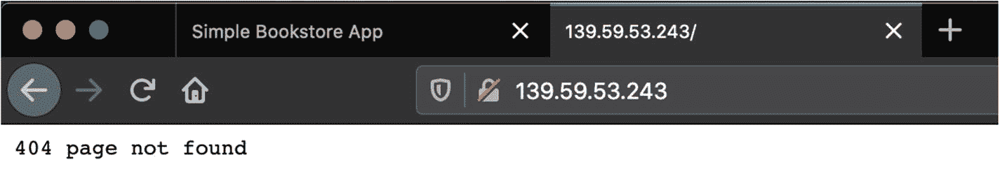

图 7-19

云负载平衡器上的默认后端

我们没有公开这个部署的`traefik`端点，所以我们不能公开访问仪表板。Traefik 文档中建议这样做。现在有两种查看仪表板的方式。你可以做任何一个。

*   直接对仪表板端口执行`kubectl port-forward`命令。这将控制面板的访问权限限制为只有那些拥有 kubeconfig 的用户(如果集群内的服务直接连接到 pod，则可能还有集群内的服务)。

*   按照 Traefik 的建议，使用安全的 IngressRoute 暴露仪表板(类似于我们在第 [4](4.html) 章中所做的)。

### Kubernetes 上的 TLS 终止通过让我们加密证书

现在您已经看到了在 Kubernetes 上运行 Traefik 所需的部分。唯一没有讨论的是 TLS 支持，这对于任何严肃的生产使用都是必要的。第 [4](4.html) 章介绍了一个公开的 Traefik 实例如何轻松地为 TLS 流量提供服务，以及如何对自动证书分发进行加密。

在第 [4](4.html) 章中，我们展示了在单个云虚拟机(或 droplet)上运行的 Traefik 上的安全路由，通过 TLS 连接(即`websecure`入口点)启用了基本身份验证。在本章中，我们尝试在 cloud Kubernetes 上使用 Traefik 做同样的事情。我们部署 BookInfo 服务，在`websecure`入口点上为它定义一个 IngressRoute，并从 Let's Encrypt 为该域请求一个有效的 TLS 证书。请记住，Let's Encrypt 只为可公开访问的域颁发有效证书。已颁发证书的域必须与您为有效 TLS 连接而访问的域的 URL 相匹配。为了用 Let's Encrypt 支持重新配置 Traefik，我们提供了一个新的 values 配置文件并升级了我们的 Helm 版本。我们还将日志级别更改为 DEBUG(参见清单 [7-23](#PC23) )。

```py
additionalArguments:
  - "--certificatesresolvers.letsencrypt.acme.email=<valid email>"
  - "--certificatesresolvers.letsencrypt.acme.httpchallenge.entrypoint=web"
  - "--certificatesresolvers.letsencrypt.acme.storage=/data/acme.json"
  - "--certificatesresolvers.letsencrypt.acme.caserver=https://acme-staging-v02.api.letsencrypt.org/directory"
  - "--log.level=DEBUG"

persistence:
  enabled: true
  size: 1Gi   #min. volume size allowed on DigitalOcean
  storageClass: "do-block-storage"

Listing 7-23New cloud-values.yml file

```

我们在这里使用类似的让我们加密配置(见清单 [7-23](#PC23) )，我们上次在第 [4](4.html) 章中使用过，除了现在我们使用 CLI 参数而不是静态 YAML 配置。为了混淆，我们使用 HTTP-01 挑战，而不是 TLS-ALPN-01 挑战。这是一种更标准、更广泛使用的挑战类型。它要求 web 入口点(端口 80)是公共可达的(让我们加密)。

我们使用 Let's Encrypt 暂存 URL，因为我们不需要获得有效的生产证书。获取的证书的存储位置需要一些额外的配置。Traefik 的舵图提供了这一点。pod 通常是暂时的，如果没有 Kubernetes 持久卷的支持，就不能将数据持久化到 pod 文件系统中。

Kubernetes 存储抽象的详细讨论超出了我们的范围。Traefik Helm 图表为向文件系统写入数据提供了一个存储位置，该位置在 pod 重新启动后仍然存在。存储安装在位于`/data`位置的运行 Traefik pod 中，我们获得的证书保存在该文件夹中。否则，证书会在 pod 重新启动时丢失。作为参考，Helm 图表生成的存储配置如清单 [7-24](#PC24) 所示。这可以像往常一样通过 Helm template 命令生成。它可以在舵图中进一步定制。存储类别`do-block-storage`属性是特定于供应商的。它需要在 DigitalOcean 中配置存储，在其他任何地方都没有用。

```py
kind: PersistentVolumeClaim
metadata:
  name: traefik
spec:
  accessModes:
    - "ReadWriteOnce"
  resources:
    requests:
      storage: "1Gi"
  storageClassName: "do-block-storage"
# Additional Deployment configuration
spec:
  template:
    spec:
        volumeMounts:
          - name: data
            mountPath: /data
      volumes:
        - name: data
          persistentVolumeClaim:
            claimName: traefik

Listing 7-24Generated Storage Value Snippets

```

我们现在可以使用清单 [7-25](#PC25) 中的文件来升级头盔以应用这个配置。

```py
% helm upgrade --values=cloud-values.yml  traefik traefik/traefik
Release "traefik" has been upgraded. Happy Helming!
NAME: traefik
LAST DEPLOYED: Sun Aug 16 20:34:16 2020
NAMESPACE: default
STATUS: deployed
REVISION: 2
TEST SUITE: None

Listing 7-25Helm Upgrade with certresolver

```

此时，我们可以使用与清单 [7-6](#PC6) 中完全相同的配置来部署 BookInfo 服务。然后，我们定义一个新的 IngressRoute 来到达该服务。首先，我们打开另一个终端，并在清单 [7-26](#PC26) 中跟踪 Traefik pod 日志。回想一下，我们将 Traefik 日志级别更改为 DEBUG。我们可以检查证书获取过程。

```py
# In a separate terminal
% kubectl get pod
NAME                      READY  STATUS
traefik-6cb8d56bf8-sghpj  1/1    Running

% kubectl logs -f traefik-6cb8d56bf8-sghpj
time="2020-08-16T15:07:37Z" level=info msg="Configuration loaded from flags."
time="2020-08-16T15:07:37Z" level=info msg="Traefik version 2.2.8 built on 2020-07-28T15:46:03Z"
time="2020-08-16T15:07:37Z" level=debug msg="Static configuration loaded...
...

Listing 7-26Secure Dashboard IngressRoute

```

让我们让它继续运行，然后回到我们的主终端来应用 IngressRoute(参见清单 [7-27](#PC27) )。

```py
# whoami-doks-ingress.yml
apiVersion: traefik.containo.us/v1alpha1
kind: IngressRoute
metadata:
  name: productpage-ingresstls
spec:
  entryPoints:
    - websecure
  routes:
  - match: Host(`k8straefik.rahulsharma.page`) && (PathPrefix(`/productpage`) || PathPrefix(`/static`) || Path(`/login`) || Path(`/logout`) || PathPrefix(`/api/v1/products`))
    kind: Rule
    services:
    - name: productpage
      port: 9080
  tls:
    certResolver: letsencrypt

#Apply the IngressRoute
% kubectl apply -f bookinfo-doks-ingress.yml

Listing 7-27TLS IngressRoute for bookinfo productpage

```

在清单 [7-16](#PC16) 的 log tail 终端中，您会看到日志中关于应用 YAML 和打开浏览器的消息(参见清单 [7-28](#PC28) )。为了简洁起见，我们省略了许多信息。我们已经在公共域提供者中添加了一个子域条目，指向我们的负载平衡器的 IP 地址。您会看到 Traefik 首先尝试使用 TLS-ALPN-01 质询类型，然后退回到 HTTP-01 质询。这个挑战是一个多步骤的过程，它提供了对我们的公共可达域上的默认 HTTP 端口进行加密的自动响应，这就是为什么端口 80 需要为这个挑战开放的原因。

```py
level=debug msg="Try to challenge certificate for domain [k8straefik.rahulsharma.page] found in HostSNI rule"
level=debug msg="Domains [\"k8straefik.rahulsharma.page\"] need ACME certificates generation for domains \"k8straefik.rahulsharma.page\"." providerName=letsencrypt.acme
level=debug msg="legolog: [INFO] [k8straefik.rahulsharma.page] acme: Could not find solver for: tls-alpn-01"
level=debug msg="legolog: [INFO] [k8straefik.rahulsharma.page] acme: use http-01 solver"
level=debug msg="legolog: [INFO] [k8straefik.rahulsharma.page] The server validated our request"
level=debug msg="legolog: [INFO] [k8straefik.rahulsharma.page] acme: Validations succeeded; requesting certificates"
level=debug msg="Certificates obtained for domains [k8straefik.rahulsharma.page]"

Listing 7-28Lets Encrypt HTTP-01 Certificate Negotiation Log Snippets

```

当您在浏览器中访问 BookInfo `productpage` URL 时，您会得到通常的响应，并且可以检查暂存证书(参见图 [7-20](#Fig20) )。

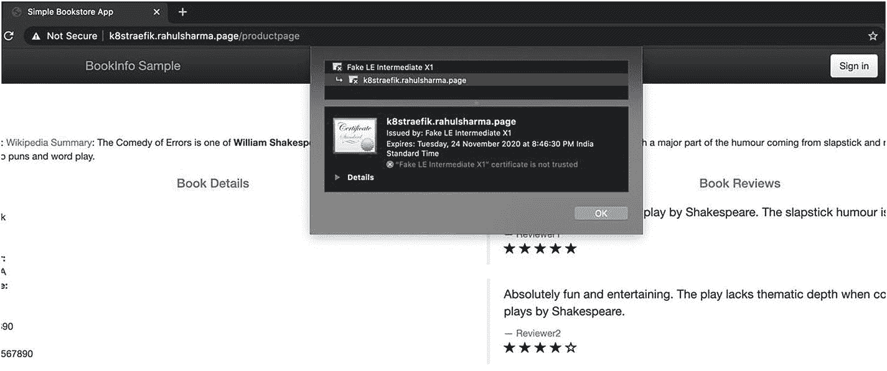

图 7-20

具有 LE 证书的云负载平衡器上的 BookInfo 产品页面 UI

### 多个 trafik 实例的 tls 证书限制

你可能会觉得我们现在已经准备好推出 Traefik 来在 Kubernetes 上运行了；然而，有一个问题。我们还没有谈到的一点是高可用性(HA)。Kubernetes 的一个优点是，它通过在同一服务的多个单元之间负载平衡流量来自动提供 HA 支持。如果启用了自动伸缩，Kubernetes 将进一步横向扩展 pod 以处理请求的增加。

这也适用于 Traefik，因为它是作为部署支持的 Kubernetes 服务运行的。这个 HA 为 Traefik ACME 协议与 Let's Encrypt 的集成带来了问题。如您之前所见，自动化的“让我们加密 TLS”挑战需要多步互动。没有办法保证 Traefik 的同一个实例接收所有的质询请求。还记得 Traefik 将动态获取的证书存储在共享持久性卷中的 acme.json 文件中。

Traefik 文档警告您，该文件不应用于多个实例的并发访问。因此，当您水平扩展 Traefik 时，让我们加密集成会崩溃。Traefik 不允许这样的部署配置继续进行；它在舵安装期间抛出一个错误。

traefike 的商业版本 traefike 支持这种分布式加密配置。然而，如果我们想坚持使用免费社区版，这种方法是行不通的。我们可以将手动获取的证书配置为 Kubernetes 机密，然后在 IngressRoute 配置中引用它，如清单 [7-29](#PC29) 所示。

```py
# whoami-doks-ingress.yml
apiVersion: traefik.containo.us/v1alpha1
kind: IngressRoute
metadata:
  name: productpage-ingresstls
spec:
  entryPoints:
    - websecure
  routes:
  - match: Host(`k8straefik.rahulsharma.page`) && PathPrefix(`/productpage`) || #etc..
    kind: Rule
    services:
    - name: productpage
      port: 9080
  tls:
    secretName: k8straefik-tls # TLS certificate already added as Kubernetes Secret

Listing 7-29TLS IngressRoute for Whoami

```

如果我们仍然希望使用 Let's Encrypt 来自动获取和更新证书，Traefik 建议使用 jet stack cert-manager([`https://cert-manager.io`](https://cert-manager.io))。Cert-manager 是 Kubernetes 上管理证书的实际解决方案。它使用与 Traefik 相同的 ACME 协议为不同的用例提供证书，尽管它不支持像 Traefik 那样的 TLS-ALPN-01 挑战。Cert-manager 拥有与 Kubernetes Ingress 的本机集成。如果我们创建一个普通的 Kubernetes 入口资源并添加正确的自定义注释，cert-manager 会自动为该域提供一个 TLS 证书。

问题是，在撰写本文时，它还不能与 Traefik 的 Ingres route CRD 一起使用。Traefik 团队正在进行这种整合。作为一种变通方法，现在，我们可以为 cert-manager 创建一个证书定制资源，它获取一个证书并将其保存为 Kubernetes 机密，然后管理其上的证书。这可以在 IngressRoute 资源中使用，如清单 [7-29](#PC29) 所示。因为这是一个可能很快解决的限制的变通方法，所以我们不详细说明它。

## 摘要

本章使用其 Helm 图表在 Kubernetes 上部署和配置了 Traefik。Traefik 与 Kubernetes 紧密集成，其 API 网关功能可以轻松映射到 Kubernetes 入口。这使得它成为用作入口控制器的非常有吸引力的提议。

您以 CRDs 的形式尝试了 Traefik 与 Kubernetes 的本机集成。您看到了 Traefik 如何检测 Kubernetes API 服务器中的动态更新，并在没有任何人工干预的情况下保持其配置更新。服务在 Kubernetes 集群中更新时，会在 Traefik 中注册和注销。

虽然这一章在压缩的时间内涵盖了许多复杂的领域，但这种复杂性是 Kubernetes 生态系统所固有的。在我们看来，Traefik 简化了在 Kubernetes 上部署和管理 API 网关的工作。

就这样，我们来到了本章和本书的结尾。Traefik 每天都在快速发展，我们鼓励您阅读 Traefik 官方文档，继续您的 Traefik 探索之旅。